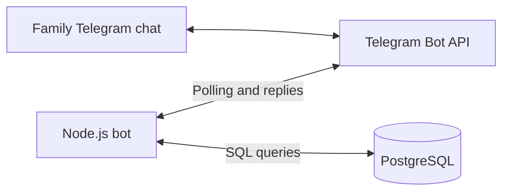

# Family Budget Telegram Bot

Track a shared family budget from a Telegram chat: add income or spending,
assign a category, and check how much is left.

I originally built this bot for my wife and me, with help from ChatGPT, over a
couple of weekends. The first version dates back to February 2023; the merged prototype also includes
later work from the `beta-v2` and `new-version` branches. This repository shares
that learning project, including its rough edges.

**ChatGPT helped write the code. The bot itself does not call an AI model or
require an OpenAI account or API key.**

> **Project status:** historical beta. The open-source cleanup documents and
> sanitizes the original project; it does not modernize the bot. Use a separate
> bot and demo database when trying it. Access control, conversation handling,
> and several commands need fixes before using real family financial data.

## Contents

- [What it does](#what-it-does)
- [How it works](#how-it-works)
- [Requirements](#requirements)
- [Local setup](#local-setup)
- [Configuration](#configuration)
- [Using the bot](#using-the-bot)
- [Commands](#commands)
- [Running with Docker](#running-with-docker)
- [Hosting](#hosting)
- [Project structure](#project-structure)
- [Known limitations](#known-limitations)
- [Troubleshooting](#troubleshooting)
- [Data and credentials](#data-and-credentials)
- [Contributing](#contributing)
- [License](#license)

## What it does

- Records `income` and `spending` transactions in PostgreSQL.
- Offers a fixed set of family-budget categories through a Telegram keyboard.
- Stores an amount, comment, date, and the initiating Telegram user's ID.
- Calculates remaining balances for categories with a non-zero balance.
- Lets a configured administrator list transactions from the last 30 days,
  list categories used in the database, and delete a category's transactions.

For this bot, income adds funds to a category and spending uses those funds:

```text
category balance = total income in that category - total spending in that category
```

For example, adding `500` of income and `24.50` of spending to `Еда` (Food) leaves
`475.50`. Budget balances cover all stored transactions; `/transactions` applies
a rolling 30-day filter. There is no automatic monthly reset or recurring budget
schedule.

## How it works



The Node.js process polls Telegram for updates through
`node-telegram-bot-api`. Command handlers collect replies, execute SQL queries
through `pg`, and send the results back to the chat. `dotenv` loads local
configuration from `.env`.

Express also starts an HTTP server on port `3000`, with JSON body parsing but
no application routes. Polling is the active transport; there is no implemented
webhook or health-check endpoint. You do not need an inbound public HTTP endpoint
for the polling bot. The database runs separately from the bot process and
container.

## Requirements

- Node.js and npm for running the bot locally.
- PostgreSQL and the `psql` client for the setup below, or equivalent database
  access through your provider.
- A Telegram account and a bot token issued by [BotFather](https://t.me/BotFather).
- Outbound network access to Telegram and connectivity to your database.
- Docker if you want to try the container instructions.

The merged prototype's Dockerfile uses Node.js 19 Alpine, which is now end of life. Use a
supported LTS release for local experimentation, and check compatibility with
these old dependencies. The repository has no declared Node.js compatibility
range or automated runtime compatibility tests. See the
[Node.js release schedule](https://nodejs.org/en/about/previous-releases).

## Local setup

### 1. Create a Telegram bot

Open [BotFather](https://t.me/BotFather), send `/newbot`, and follow the prompts.
Keep the issued token private; you will put it in your local `.env` file.

For a shared group, add the bot to your private test group. This implementation
expects ordinary text replies to its questions. In BotFather, use `/setprivacy`,
select your bot, and choose `Disable` so it can receive those replies. Remove
and re-add the bot to the group after changing this setting. Disabling privacy
mode also lets it see other group messages, which matters because the current
conversation listeners are global. See
[Telegram's privacy-mode documentation](https://core.telegram.org/bots/features#privacy-mode).

You can also try the commands in a private conversation with the bot. Keep a
single conversation active while testing.

### 2. Clone the repository and install dependencies

```sh
git clone https://github.com/michael-pov-it/tg-expenses-bot.git
cd tg-expenses-bot
npm ci
cp .env.example .env
```

On Windows, copy `.env.example` to `.env` with your file manager or shell's copy
command. Run the application from the repository directory so `dotenv` finds
that file.

### 3. Prepare PostgreSQL

If you already have a database and application user, go straight to creating
the table. Otherwise, connect as a PostgreSQL administrator; for a local server
with the usual administrator role, this can be:

```sh
psql --host localhost --username postgres --dbname postgres
```

Create a dedicated application role and database. `\password` prompts for a
password instead of embedding it in SQL or shell history:

```sql
CREATE ROLE expenses WITH LOGIN;
\password expenses
CREATE DATABASE expenses OWNER expenses;
```

Exit with `\q`, then connect as the application user:

```sh
psql --host localhost --port 5432 --username expenses --dbname expenses --password
```

The original database schema was not checked in. The following **suggested
schema is inferred from the current insert and reporting queries** and is
intended for a fresh demo database. It is not a migration for an existing
database. In particular, the merged `/add` handler requires the `comment` and
`user_id` columns; the older schema without those columns is insufficient.

```sql
CREATE TABLE budget (
    id BIGINT GENERATED ALWAYS AS IDENTITY PRIMARY KEY,
    type TEXT NOT NULL CHECK (type IN ('income', 'spending')),
    category TEXT NOT NULL CHECK (length(trim(category)) > 0),
    comment TEXT NOT NULL DEFAULT '',
    user_id BIGINT NOT NULL,
    amount NUMERIC(12, 2) NOT NULL
        CHECK (amount > 0 AND amount <> 'NaN'::numeric),
    date_of_transaction TIMESTAMPTZ NOT NULL DEFAULT CURRENT_TIMESTAMP
);
```

The database generates the transaction ID. `/add` explicitly supplies the type,
category, amount, comment, initiating user ID, and the current calendar date.
Its date string has no time of day, so those inserts store midnight in the
database session time zone. The timestamp default is useful for other inserts.
The checks reject invalid types, empty categories, and non-positive or `NaN`
amounts at the database level; application validation still needs fixes. PostgreSQL documents these constructs
in [CREATE TABLE](https://www.postgresql.org/docs/current/sql-createtable.html).

### 4. Configure the environment

Edit `.env` using the values for your own bot and database:

```dotenv
BOT_TOKEN=your_bot_token
DB_HOST=localhost
DB_PORT=5432
DB_NAME=expenses
DB_USERNAME=expenses
DB_PASSWORD=your_database_password
CURRENCY=EUR
ADMIN_USER_ID=
```

The values above are placeholders. Keep `.env` local; `.env.example` is the
shareable template. Administrator commands are disabled until you set
`ADMIN_USER_ID` to your own numeric Telegram user ID. See
[Configuration](#configuration) for that setup, the currency caveat, and
connection-string behavior.

### 5. Start the bot

```sh
npm start
```

A successful database connection prints `PG connection established successfully!`.
The HTTP server also logs `Express server listening on port 3000`; that log
does not prove that Telegram polling or the database connection is healthy.

In your test chat, send `/start` to see the menu, then `/add` and follow the prompts. Stop the process with
`Ctrl+C`. Run only one bot process for a given token, and ensure no Telegram
webhook is active: Telegram cannot deliver polling updates while a webhook is
set. See the [Telegram Bot FAQ](https://core.telegram.org/bots/faq#how-do-i-get-updates).

## Configuration

| Variable | Purpose | Example or caveat |
| --- | --- | --- |
| `BOT_TOKEN` | Authenticate to the Telegram Bot API. | Your token from BotFather; required. |
| `DB_HOST` | PostgreSQL hostname or address. | `localhost` when the bot and database run directly on the same machine. |
| `DB_PORT` | PostgreSQL port. | Usually `5432`; set it explicitly. |
| `DB_NAME` | Database containing the `budget` table. | `expenses`. |
| `DB_USERNAME` | PostgreSQL application user. | `expenses`. |
| `DB_PASSWORD` | Password for the application user. | Required for the password-authenticated setup above. |
| `CURRENCY` | Intended currency selection. | The merged implementation ignores this value and always displays `€`. |
| `ADMIN_USER_ID` | Telegram user allowed to run `/transactions`, `/categories`, and `/delete`. | Your numeric user ID; blank denies all administrator commands. |

The code constructs a PostgreSQL URL by interpolating these values. Reserved
characters in the username or password must be URL-encoded for that connection
string. There is no `DATABASE_URL`, configurable database TLS mode, or `PORT`
setting in the application. Managed databases that require additional TLS
configuration need a code change.

To find your own ID using the current prototype, initially leave
`ADMIN_USER_ID` blank and send `/categories` in your private test chat. The
command is denied, and its handler prints the requesting user ID to your local
terminal. Stop the bot, set that ID in `.env`, and restart. This restriction
applies only to the three administrator commands; `/add` and `/budget` are
not restricted by user or chat.

Category names are case-sensitive. `/add` accepts only the built-in category
names listed below. Enter positive amounts with a dot for decimals, and store
all transactions in the same currency: there is no per-transaction currency
column.

## Using the bot

Send `/start` for the command menu. An example of funding a category, using the
actual prompts in the merged prototype:

```text
You: /add
Bot: Please select the transaction type:
You: income
Bot: Please select a category:
You: Еда
Bot: Please enter the amount:
You: 500
Bot: Please enter a comment (optional):
You: food budget
Bot: Transaction added successfully!
```

Repeat `/add`, this time replying `spending`, `Еда`, `24.50`, and
`weekly groceries`. Send `/budget` to see the remaining balance of `€475.50`.
The currency symbol is hard-coded even if you set `CURRENCY` to another value.

The category buttons are currently hard-coded in Russian:

| Category value | Meaning |
| --- | --- |
| `Дом` | Home |
| `Еда` | Food |
| `Рестораны` | Restaurants |
| `Развлечения` | Entertainment |
| `Другое` | Other |

The comment prompt says optional, but the handler waits for a text reply;
there is no skip button or `/skip` command. Use a short placeholder such as
`-` when you have no comment.

Finish the exchange before starting another transaction, and avoid other
messages during it. There is no `/cancel` command, conversation timeout, or
separate conversation state for each user. Category labels and some error
messages are in Russian; most prompts are in English.

## Commands

| Command | Current behavior |
| --- | --- |
| `/start` | Display a welcome message and the `/start`, `/add`, `/budget` keyboard. |
| `/add` | Ask for type, category, amount, and comment; insert a transaction with date and user ID. |
| `/budget` | Show all-time category balances except zero balances, including overspent categories. |
| `/transactions` | Administrator: list transactions from the last 30 days with dates, amounts, categories, and comments. |
| `/categories` | Administrator: list distinct category values already stored in the database. |
| `/delete Еда` | Administrator: delete every transaction whose category is exactly `Еда`, across all dates. |

Administrator commands require the caller's user ID to match `ADMIN_USER_ID`.
Category deletion has no confirmation or undo. It supports Unicode and spaces,
but the category must match the stored value exactly, including case and any
trailing whitespace.

The merged prototype does not implement `/help`, `/cancel`, `/last`, `/list`,
`/update`, or `/keyboard`; older commits contain some of those handlers.
Reports have no guaranteed sort order or pagination, and a long report can
exceed Telegram's message-length limit.

## Running with Docker

Configure the database and `.env` first, then build the original container:

```sh
docker build -t tg-expenses-bot .
docker run --rm --env-file .env tg-expenses-bot
```

The Dockerfile copies application files and installs the locked dependencies.
Credentials are supplied at runtime; the `.env` file is excluded from the
build context. PostgreSQL is not included in the image.

Inside a container, `localhost` means the container itself. Set `DB_HOST` to a
hostname or address the container can reach, such as a database container's
name on a shared Docker network. If using Docker Desktop and a database on the
host, use the host address supported by your Docker installation.

Polling does not require publishing port `3000` to the host. The retained
Node.js 19 Alpine base image and old dependencies need updating before deploying
a production instance.

## Hosting

The original project used GitHub Actions to build a Docker image and deploy it
to Google Cloud Run, with PostgreSQL hosted separately. That personal deployment
workflow has been removed from the current branch tips during cleanup.

There is no maintained deployment workflow or Docker Compose setup in this
repository. A polling deployment needs a continuously running process,
database connectivity, and one instance per bot token. Deployment to Cloud Run
requires accounting for its CPU allocation, instance lifecycle, and scaling;
the listening HTTP server has no webhook or health-check route. Hosting modernization is future work.

## Project structure

```text
.
├── commands/
│   └── functions.js      # /start welcome message and command keyboard
├── test/
│   └── bot.test.js        # Offline transaction and administrator checks
├── index.js              # Startup, polling, Express, and command handlers
├── package.json          # App metadata, runtime dependencies, start/test scripts
├── package-lock.json     # Locked dependency versions
├── Dockerfile            # Prototype Node.js 19 Alpine container
├── .dockerignore         # Excludes local credentials and files from builds
├── .env.example          # Environment template with no real credentials
├── .gitignore            # Excludes local config, dependencies, and data exports
├── README.md
└── LICENSE               # GNU GPL version 3
```

## Known limitations

This list describes the merged historical prototype, including behavior that
still needs work before use with real family finances:

- **Partial access control and no chat isolation.** Only `/transactions`,
  `/categories`, and `/delete` check `ADMIN_USER_ID`. `/add` and `/budget` are
  unrestricted. All chats share one table; there is no `chat_id` column, and
  storing `user_id` does not isolate data or restrict reporting queries.
- **Global conversations.** `/add` listens for messages without checking the
  originating chat or user. Simultaneous conversations or unrelated messages
  can interfere. Non-text input at the type step can throw an error.
- **Permissive amount parsing.** `parseFloat` accepts numeric prefixes and the
  handler does not reject zero, negative, or infinite amounts itself. The
  suggested database constraints reject invalid stored amounts.
- **Fixed categories and currency.** Category buttons are hard-coded in Russian;
  currency is hard-coded to euros and `CURRENCY` has no effect.
- **Incomplete comment/date handling.** A comment reply is required despite the
  optional label. Inserted dates have day precision rather than the actual
  transaction time of day.
- **Limited reports.** Zero category balances are omitted, transaction reports
  cover only the last 30 days, and there is no sorting guarantee or pagination.
- **Old runtime and dependencies.** The prototype's versions are retained.
  Dependency upgrades and a supported container base are still needed.
- **Limited operational handling.** There is no graceful shutdown, automatic
  migration, backup job, or live integration test coverage.
- **Unused HTTP listener.** Express reserves port `3000` but exposes no
  application, webhook, or health-check endpoint.

## Troubleshooting

| Symptom | What to check |
| --- | --- |
| Telegram returns `401 Unauthorized`. | Confirm `BOT_TOKEN` is set, correct, and has not been revoked. |
| Telegram reports a polling conflict. | Stop other processes using the token; remove any active webhook. |
| Commands arrive but answers to questions do not. | Check group privacy mode, re-add the bot after changing it, or test in a private chat. |
| PostgreSQL connection is refused. | Check that PostgreSQL is running and that the host/port are reachable from the bot process or container. |
| PostgreSQL authentication fails. | Check the role, password, access rules, and URL encoding of credential characters. |
| `relation "budget" does not exist`. | Create the table in the database selected by `DB_NAME`, as the application user. |
| PostgreSQL reports a missing `comment` or `user_id` column. | The merged `/add` requires the schema documented above; the older five-column schema is insufficient. |
| `/transactions`, `/categories`, or `/delete` is denied. | Configure `ADMIN_USER_ID` with your numeric Telegram ID and restart the bot. |
| `/budget` omits a category. | Zero balances are hidden; compare the stored category value and funding/spending totals. |
| `/transactions` shows no entries. | It only includes entries within the last 30 days. |
| The bot keeps asking for a category. | Choose one of the exact built-in Russian category names. |
| The transaction never completes after the amount. | Send a text comment or `-`; the optional comment prompt still requires a reply. |
| The bot displays `€` for another configured currency. | Currency is hard-coded in this prototype. |
| Port `3000` is already in use. | Stop the conflicting process or change the hard-coded Express port in `index.js`. |

## Data and credentials

All transactions live in PostgreSQL, not in the bot container. There is no bank
connection, payment processing, receipt upload, or automatic backup job.

Keep backups and exports private. For a local demo database, an example backup
using PostgreSQL's `pg_dump` is:

```sh
mkdir -p backups
pg_dump --host localhost --port 5432 --username expenses --dbname expenses --format=custom --file=backups/expenses.dump
```

Use a fresh database and synthetic amounts for development. Do not put real
transactions, `.env` files, tokens, passwords, or database exports into commits,
issues, pull requests, screenshots, or logs you share publicly.

Previously committed credentials must be revoked or rotated even after Git
history is cleaned. A history rewrite cannot invalidate a token or password or
remove somebody else's clone; old pull-request references and cached views may
also remain on GitHub. See
[GitHub's sensitive-data removal guidance](https://docs.github.com/en/authentication/keeping-your-account-and-data-secure/removing-sensitive-data-from-a-repository).

If you cloned the repository before its history cleanup, make a fresh clone
before contributing so an old branch or merge does not reintroduce the removed
history.

## Contributing

Bug reports, documentation corrections, and focused improvements are welcome.
Open an [issue](https://github.com/michael-pov-it/tg-expenses-bot/issues) with the
command you ran, expected and actual behavior, Node.js/PostgreSQL versions, and
redacted error output. For a pull request, explain the change and how you
verified it. Use your own test bot and a disposable database.

Useful next improvements include chat/user access control, isolated and
cancelable conversation state, correct amount and currency handling, consistent
reporting, database migrations, and dependency/runtime updates.

The test suite runs the actual command handlers with fake Telegram, HTTP, and
PostgreSQL connections. It covers completing a transaction, removing its
conversation listener, and allowing/denying administrator commands. Checks
available without live credentials are:

```sh
node --check index.js
node --check commands/functions.js
npm test
npm ci --omit=dev --ignore-scripts --dry-run
```

The suite checks handler behavior offline, and the other commands check syntax
and package resolution. They do not validate live Telegram or PostgreSQL
behavior. End-to-end verification requires a separate test bot and demo
database.

## License

Released under the **GNU General Public License, version 3**. See
[LICENSE](LICENSE) for the complete terms. Package metadata identifies the
license as `GPL-3.0-only`.
