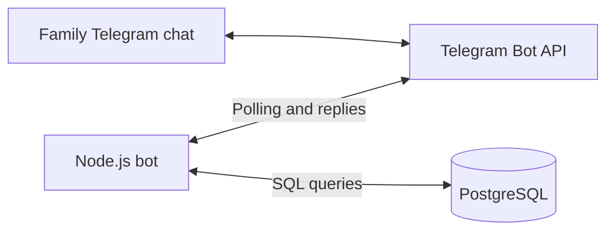

# Family Budget Telegram Bot

Track a shared family budget from a Telegram chat: add income or spending,
assign a category, and check how much is left.

I originally built this bot for my wife and me, with help from ChatGPT, over a
couple of weekends. The original application code dates back to February 2023.
This repository shares that learning project, including its rough edges.

**ChatGPT helped write the code. The bot itself does not call an AI model or
require an OpenAI account or API key.**

> **Project status:** historical beta. The open-source cleanup documents and
> sanitizes the original project; it does not modernize the bot. Use a separate
> bot and demo database when trying it. Access control, conversation handling,
> and several commands need fixes before using real family financial data.

## Contents

- [What it does](#what-it-does)
- [How it works](#how-it-works)
- [Requirements](#requirements)
- [Local setup](#local-setup)
- [Configuration](#configuration)
- [Using the bot](#using-the-bot)
- [Commands](#commands)
- [Running with Docker](#running-with-docker)
- [Hosting](#hosting)
- [Project structure](#project-structure)
- [Known limitations](#known-limitations)
- [Troubleshooting](#troubleshooting)
- [Data and credentials](#data-and-credentials)
- [Contributing](#contributing)
- [License](#license)

## What it does

- Records `income` and `spending` transactions in PostgreSQL.
- Groups transactions by a category you enter, such as `groceries` or `transport`.
- Calculates the remaining balance for each category.
- Lists transactions from the current month or across the whole database.
- Lists income and spending totals by category.
- Deletes all transactions in a selected category.

For this bot, income adds funds to a category and spending uses those funds:

```text
category balance = total income in that category - total spending in that category
```

For example, adding `500` of income and `24.50` of spending to `groceries` leaves
`475.50`. Budget balances cover all stored transactions; only `/last` applies a
month filter. There is no automatic monthly reset or recurring budget schedule.

## How it works



The Node.js process polls Telegram for updates through
`node-telegram-bot-api`. Command handlers collect replies, execute SQL queries
through `pg`, and send the results back to the chat. `dotenv` loads local
configuration from `.env`.

Express also starts an HTTP server on port `3000`. Its legacy webhook route is
unfinished; polling is the active transport. You do not need an inbound public
HTTP endpoint for the polling bot. The database runs separately from the bot
process and container.

## Requirements

- Node.js and npm for running the bot locally.
- PostgreSQL and the `psql` client for the setup below, or equivalent database
  access through your provider.
- A Telegram account and a bot token issued by [BotFather](https://t.me/BotFather).
- Outbound network access to Telegram and connectivity to your database.
- Docker if you want to try the container instructions.

The original Dockerfile uses Node.js 16, which is now end of life. Use a
supported LTS release for local experimentation, and check compatibility with
these old dependencies. The repository has no declared Node.js compatibility
range or automated runtime compatibility tests. See the
[Node.js release schedule](https://nodejs.org/en/about/previous-releases).

## Local setup

### 1. Create a Telegram bot

Open [BotFather](https://t.me/BotFather), send `/newbot`, and follow the prompts.
Keep the issued token private; you will put it in your local `.env` file.

For a shared group, add the bot to your private test group. This implementation
expects ordinary text replies to its questions. In BotFather, use `/setprivacy`,
select your bot, and choose `Disable` so it can receive those replies. Remove
and re-add the bot to the group after changing this setting. Disabling privacy
mode also lets it see other group messages, which matters because the current
conversation listeners are global. See
[Telegram's privacy-mode documentation](https://core.telegram.org/bots/features#privacy-mode).

You can also try the commands in a private conversation with the bot. Keep a
single conversation active while testing.

### 2. Clone the repository and install dependencies

```sh
git clone https://github.com/michael-pov-it/tg-expenses-bot.git
cd tg-expenses-bot
npm ci
cp .env.example .env
```

On Windows, copy `.env.example` to `.env` with your file manager or shell's copy
command. Run the application from the repository directory so `dotenv` finds
that file.

### 3. Prepare PostgreSQL

If you already have a database and application user, go straight to creating
the table. Otherwise, connect as a PostgreSQL administrator; for a local server
with the usual administrator role, this can be:

```sh
psql --host localhost --username postgres --dbname postgres
```

Create a dedicated application role and database. `\password` prompts for a
password instead of embedding it in SQL or shell history:

```sql
CREATE ROLE expenses WITH LOGIN;
\password expenses
CREATE DATABASE expenses OWNER expenses;
```

Exit with `\q`, then connect as the application user:

```sh
psql --host localhost --port 5432 --username expenses --dbname expenses --password
```

The original database schema was not checked in. The following **suggested
schema is inferred from the current insert and reporting queries** and is
intended for a fresh demo database. It is not a migration for an existing
database and does not support the legacy `/update` command.

```sql
CREATE TABLE budget (
    id BIGINT GENERATED ALWAYS AS IDENTITY PRIMARY KEY,
    type TEXT NOT NULL CHECK (type IN ('income', 'spending')),
    category TEXT NOT NULL CHECK (length(trim(category)) > 0),
    amount NUMERIC(12, 2) NOT NULL
        CHECK (amount > 0 AND amount <> 'NaN'::numeric),
    date_of_transaction TIMESTAMPTZ NOT NULL DEFAULT CURRENT_TIMESTAMP
);
```

The ID and timestamp defaults are required because `/add` inserts only the
category, type, and amount. The checks reject invalid transaction types, empty
categories, and non-positive or `NaN` amounts at the database level; the bot's
own input validation still needs fixes. PostgreSQL documents these constructs
in [CREATE TABLE](https://www.postgresql.org/docs/current/sql-createtable.html).

### 4. Configure the environment

Edit `.env` using the values for your own bot and database:

```dotenv
BOT_TOKEN=your_bot_token
DB_HOST=localhost
DB_PORT=5432
DB_NAME=expenses
DB_USERNAME=expenses
DB_PASSWORD=your_database_password
CURRENCY=EUR
```

The values above are placeholders. Keep `.env` local; `.env.example` is the
shareable template. See [Configuration](#configuration) for the currency caveat
and connection-string behavior.

### 5. Start the bot

```sh
npm start
```

A successful database connection prints `PG connection established`. The HTTP
server also logs that it is listening on port `3000`; this log does not prove
that Telegram polling or both database connections are healthy.

In your test chat, send `/add` and follow the prompts. Stop the process with
`Ctrl+C`. Run only one bot process for a given token, and ensure no Telegram
webhook is active: Telegram cannot deliver polling updates while a webhook is
set. See the [Telegram Bot FAQ](https://core.telegram.org/bots/faq#how-do-i-get-updates).

## Configuration

| Variable | Purpose | Example or caveat |
| --- | --- | --- |
| `BOT_TOKEN` | Authenticate to the Telegram Bot API. | Your token from BotFather; required. |
| `DB_HOST` | PostgreSQL hostname or address. | `localhost` when the bot and database run directly on the same machine. |
| `DB_PORT` | PostgreSQL port. | Usually `5432`; set it explicitly. |
| `DB_NAME` | Database containing the `budget` table. | `expenses`. |
| `DB_USERNAME` | PostgreSQL application user. | `expenses`. |
| `DB_PASSWORD` | Password for the application user. | Required for the password-authenticated setup above. |
| `CURRENCY` | Intended currency selection. | The original implementation ignores this value and displays `$`. |

The code constructs a PostgreSQL URL by interpolating these values. Reserved
characters in the username or password must be URL-encoded for that connection
string. There is no `DATABASE_URL`, configurable database TLS mode, or `PORT`
setting in the application. Managed databases that require additional TLS
configuration need a code change.

Category names are stored as entered and are case-sensitive. Amounts are
entered as positive numbers, using a dot for decimals. Store all transactions
in the same currency: the database has no per-transaction currency column.

## Using the bot

An example of funding a category, using the actual current prompts:

```text
You: /add
Bot: Что бы Вы хотели добавить? (income || spending)
You: income
Bot: What is the amount of the transaction?
You: 500
Bot: What category does this income belong to?
You: groceries
Bot: income added successfully.
```

Repeat `/add`, this time replying `spending`, then `24.50`, then `groceries`.
Send `/budget` to see the remaining category balance of `475.50`. The current
code displays a dollar symbol even if `CURRENCY=EUR`.

Finish the three questions before starting another transaction, and avoid
other messages during that exchange. The bot does not have a `/cancel`
command, conversation timeout, or separate conversation state for each user.
Some prompts are in Russian and others in English.

## Commands

| Command | Current behavior |
| --- | --- |
| `/add` | Ask for `income` or `spending`, then amount and category; insert a transaction. |
| `/budget` | Show all-time category balances that are zero or positive. Overspent categories are hidden. |
| `/last` | List transactions dated from the start of the current database month onward. |
| `/transactions` | List all stored transactions with their IDs, types, categories, and amounts. |
| `/list income` | Sum income by category, counting only individual entries with `amount > 1`. |
| `/list spending` | Sum spending by category, counting only individual entries with `amount > 1`. |
| `/delete groceries` | Delete every stored transaction whose category is exactly `groceries`, across all dates. |
| `/keyboard` | Display a legacy `START BOT` button; it is not a complete onboarding flow. |
| `/update` | Legacy handler that expects separate `income` and `spending` columns. Incompatible with the transaction schema above. |

Deletion has no confirmation or undo. `/delete` captures only ASCII letters,
digits, and underscores; spaces or punctuation end the captured category name.
Use simple category names when experimenting, and double-check what a command
will match before deleting data.

There are no implemented `/start`, `/help`, or `/cancel` command handlers.
Reports have no guaranteed sort order or pagination. `/last` groups rows by
formatted timestamp, category, type, and amount, so identical transactions
within the same second can appear as one entry in that report.

## Running with Docker

Configure the database and `.env` first, then build the original container:

```sh
docker build -t tg-expenses-bot .
docker run --rm --env-file .env tg-expenses-bot
```

The Dockerfile copies application files and installs the locked dependencies.
Credentials are supplied at runtime; the `.env` file is excluded from the
build context. PostgreSQL is not included in the image.

Inside a container, `localhost` means the container itself. Set `DB_HOST` to a
hostname or address the container can reach, such as a database container's
name on a shared Docker network. If using Docker Desktop and a database on the
host, use the host address supported by your Docker installation.

Polling does not require publishing port `3000` to the host. The retained
Node.js 16 base image and old dependencies need updating before deploying a
production instance.

## Hosting

The original project used GitHub Actions to build a Docker image and deploy it
to Google Cloud Run, with PostgreSQL hosted separately. That personal deployment
workflow has been removed from the current branch tips during cleanup.

There is no maintained deployment workflow or Docker Compose setup in this
repository. A polling deployment needs a continuously running process,
database connectivity, and one instance per bot token. Deployment to Cloud Run
requires accounting for its CPU allocation, instance lifecycle, and scaling;
the historical HTTP route does not turn this application into a working webhook
bot. Hosting modernization is future work.

## Project structure

```text
.
├── commands/
│   └── transactions.js   # /transactions handler and a second database client
├── index.js              # Startup, polling, Express, and other command handlers
├── package.json          # App metadata, runtime dependencies, and start script
├── package-lock.json     # Locked dependency versions
├── Dockerfile            # Original Node.js 16 container
├── .dockerignore         # Excludes local credentials and files from builds
├── .env.example          # Environment template with no real credentials
├── .gitignore            # Excludes local config, dependencies, and data exports
├── README.md
└── LICENSE               # GNU GPL version 3
```

## Known limitations

This list describes the code as it exists, including behavior that differs
from the intended family-budget experience:

- **No access control or chat isolation.** Every chat handled by the bot uses the
  same table. There is no user allowlist or `chat_id` column. A person who can
  interact with a deployed bot may be able to read or delete its budget data.
- **Global conversations.** `/add` and `/update` use `bot.once('message', ...)`
  without checking the originating chat or user. Unrelated replies can fill in
  another person's transaction; non-text messages can also cause errors.
- **Broken amount validation.** The application combines the `NaN` and
  non-positive checks incorrectly and uses permissive `parseFloat` parsing.
- **Broken currency selection.** An ordinary quoted string is used where an
  environment value was intended, so `CURRENCY` has no effect.
- **Inconsistent reports.** Negative category balances are omitted, `/list`
  ignores entries of `1` or less, and `/last` can combine duplicate rows.
- **Incomplete commands.** `/update` uses an incompatible old schema; the
  keyboard button does not supply a complete start/help flow.
- **Old runtime and dependencies.** Versions are retained from the original
  project. Dependency upgrades and a supported container base are still needed.
- **Limited operational handling.** Two database clients are created, connection
  failures are handled inconsistently, and there is no graceful shutdown,
  report pagination, or automated test suite.
- **Unfinished HTTP support.** The webhook route lacks JSON body parsing and
  is present alongside active polling. Keep it private until it is reworked.

## Troubleshooting

| Symptom | What to check |
| --- | --- |
| Telegram returns `401 Unauthorized`. | Confirm `BOT_TOKEN` is set, correct, and has not been revoked. |
| Telegram reports a polling conflict. | Stop other processes using the token; remove any active webhook. |
| Commands arrive but answers to questions do not. | Check group privacy mode, re-add the bot after changing it, or test in a private chat. |
| PostgreSQL connection is refused. | Check that PostgreSQL is running and that the host and port are reachable from the bot process or container. |
| PostgreSQL authentication fails. | Check the role, password, database access rules, and URL encoding of credential characters. |
| `relation "budget" does not exist`. | Create the table in the database selected by `DB_NAME`, as the application user. |
| `/budget` omits a category. | It hides negative balances; check category spelling/case and inspect `/transactions`. |
| `/list` omits a small transaction. | Its query only includes individual amounts greater than `1`. |
| The bot displays `$` for an EUR budget. | This is the documented currency bug. |
| Port `3000` is already in use. | Stop the conflicting local process or change the hard-coded Express port in `index.js`. |
| `/update` fails. | It needs reimplementation for the transaction schema; it is not supported by the suggested setup. |

## Data and credentials

All transactions live in PostgreSQL, not in the bot container. There is no bank
connection, payment processing, receipt upload, or automatic backup job.

Keep backups and exports private. For a local demo database, an example backup
using PostgreSQL's `pg_dump` is:

```sh
mkdir -p backups
pg_dump --host localhost --port 5432 --username expenses --dbname expenses --format=custom --file=backups/expenses.dump
```

Use a fresh database and synthetic amounts for development. Do not put real
transactions, `.env` files, tokens, passwords, or database exports into commits,
issues, pull requests, screenshots, or logs you share publicly.

Previously committed credentials must be revoked or rotated even after Git
history is cleaned. A history rewrite cannot invalidate a token or password or
remove somebody else's clone; old pull-request references and cached views may
also remain on GitHub. See
[GitHub's sensitive-data removal guidance](https://docs.github.com/en/authentication/keeping-your-account-and-data-secure/removing-sensitive-data-from-a-repository).

If you cloned the repository before its history cleanup, make a fresh clone
before contributing so an old branch or merge does not reintroduce the removed
history.

## Contributing

Bug reports, documentation corrections, and focused improvements are welcome.
Open an [issue](https://github.com/michael-pov-it/tg-expenses-bot/issues) with the
command you ran, expected and actual behavior, Node.js/PostgreSQL versions, and
redacted error output. For a pull request, explain the change and how you
verified it. Use your own test bot and a disposable database.

Useful next improvements include chat/user access control, isolated and
cancelable conversation state, correct amount and currency handling, consistent
reporting, database migrations, and dependency/runtime updates.

There is currently no `npm test` script. Basic checks available without live
credentials are:

```sh
node --check index.js
node --check commands/transactions.js
npm ci --omit=dev --ignore-scripts --dry-run
```

These check syntax and package resolution; they do not exercise Telegram or
PostgreSQL behavior. Functional verification requires your separate test bot
and demo database.

## License

Released under the **GNU General Public License, version 3**. See
[LICENSE](LICENSE) for the complete terms. Package metadata identifies the
license as `GPL-3.0-only`.
